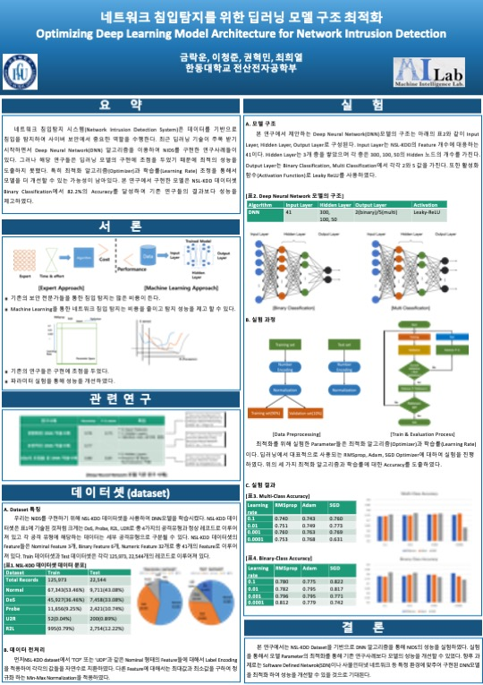

# Deep learning for network intrusion detection project

## Project description
Network Intrusion Detection System (NIDS) is an essential tool for network perimeter security. NIDS inspects network traffic packets to detect network intrusions. Most of the existing works have used machine learning techniques for building the system. While the reported works demonstrated the effectiveness of various artificial intelligence algorithms, only a few of them have utilized the time-series information of network traffic data. Also, categorical information of network traffic data has not been included in neural network-based approaches. In this paper, we propose network intrusion detection models based on sequential information using the long short-term memory (LSTM) network and categorical information using the embedding technique. We have conducted experiments using models with UNSW-NB15, which is a comprehensive network traffic dataset. The experiment results confirm that the proposed method improves the performance, with a binary classification accuracy rate of 99.72%.

- published paper
    - <a href="https://www.dbpia.co.kr/journal/articleDetail?nodeId=NODE10545775" title="paper">Improvement in Network Intrusion Detection based on LSTM and Feature Embedding</a>

- poster
    - 

## Usage
```bash
    # 1. prepare data
    python preprocess.py

    # training and testing
    ./model.sh
```
